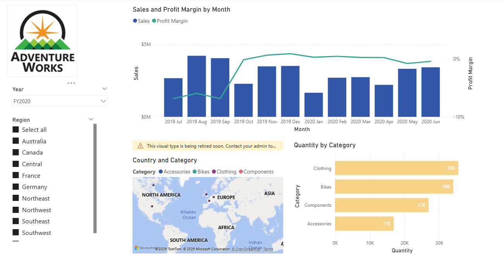
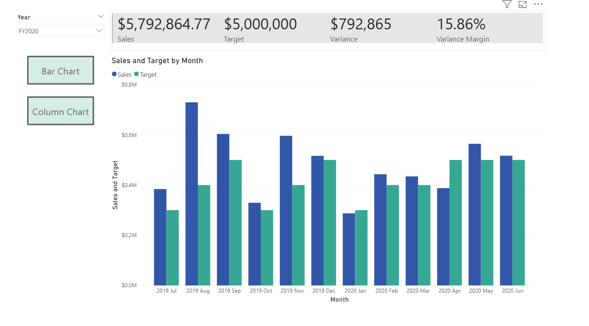
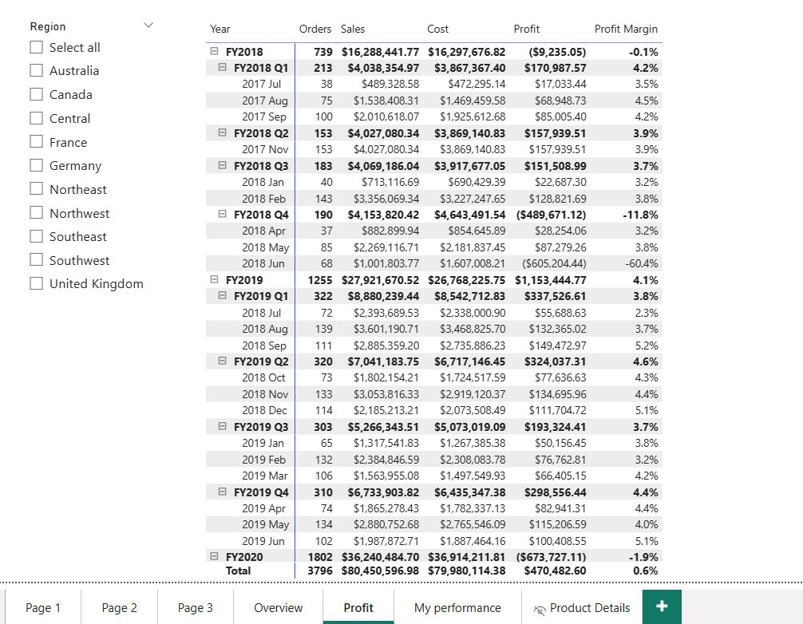
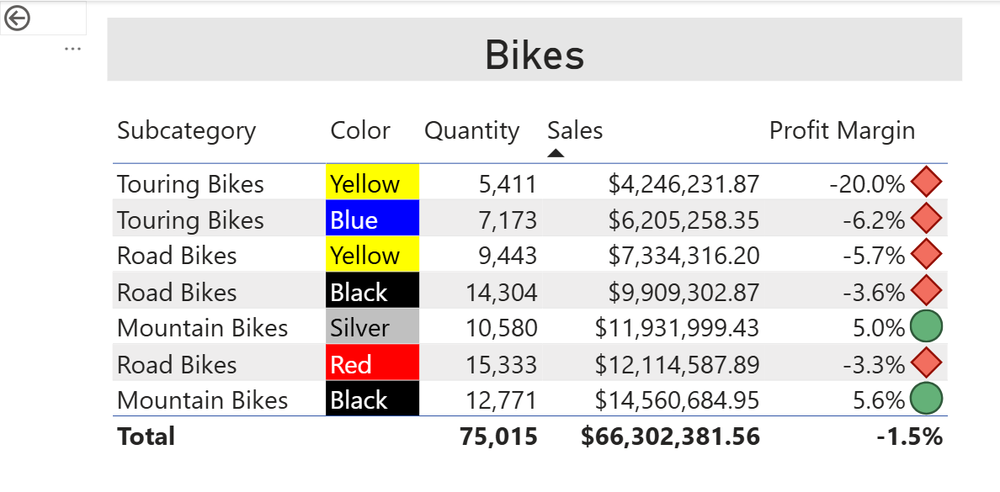
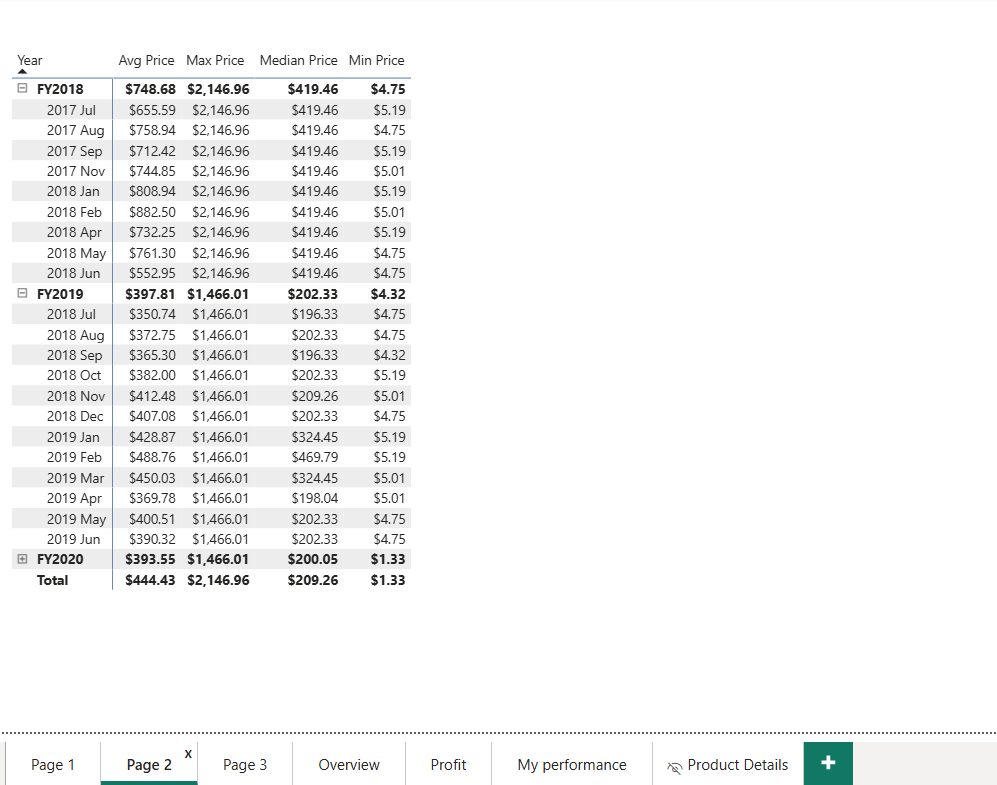
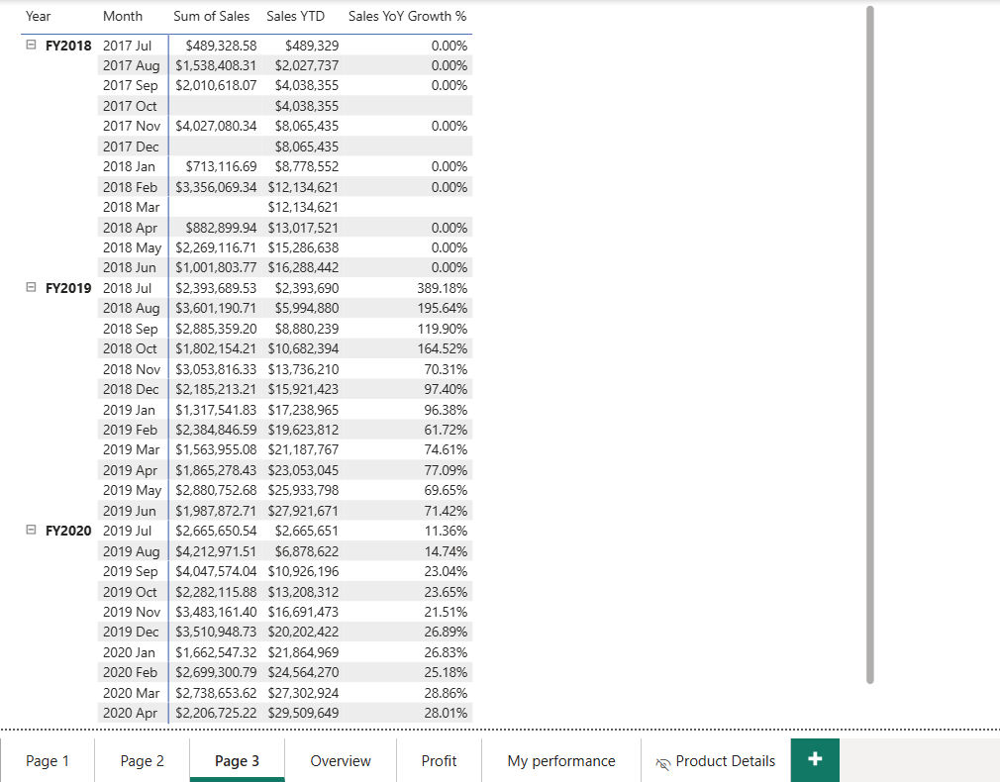
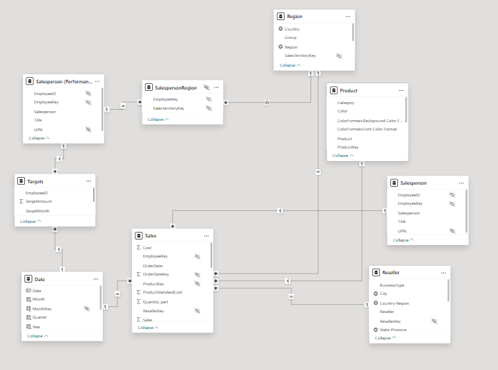

  

<h1 align="center">Adventure Works - Sales Analysis Dashboard</h1>

  
  
  

> Guided Project · IBT Learning × GGateway Bootcamp · June 2026

A 6-page interactive Power BI dashboard analyzing **$80M in sales** across Bikes, Accessories, Clothing, and Components for Adventure Works - a fictional outdoor sports company - covering **FY2018 to FY2020**.

---

## Dashboard Preview

| Overview | My Performance |
|----------|----------------|
|  |  |

| Profit Analysis | Product Details |
|----------------|-----------------|
|  |  |

| Pricing Intelligence | Sales Growth |
|---------------------|--------------|
|  |  |

---

## Pages

| Page | Description |
|------|-------------|
| **Overview** | Monthly Sales vs. Profit Margin trend with year and region filters across 10 global markets |
| **Profit** | Quarterly P&L breakdown by fiscal year - orders, sales, cost, profit, and margin |
| **Pricing** | Avg, Max, Median, and Min price trends across FY2018–2020 |
| **Sales Growth** | YTD accumulation and YoY growth % tracking by month |
| **My Performance** | Salesperson Sales vs. Target with KPI cards and Bar/Column chart toggle |
| **Product Details** | Subcategory drill-through with color-level profit margin and conditional formatting icons |

---

## Data Model

Star schema with 7 tables connecting through the central **Sales** fact table.

| Table | Type |
|-------|------|
| Sales | Fact |
| Date | Dimension |
| Product | Dimension |
| Salesperson | Dimension |
| Region | Dimension |
| Reseller | Dimension |
| Targets | Dimension |

---

## Files

| File | Description |
|------|-------------|
| `AdventureWorks_Final.pbix` | Main Power BI report file |
| `ColorFormats.csv` | Custom color formatting rules |
| `ResellerSalesTargets.csv` | Sales target data by salesperson |

---

## Tools & Skills

| Tool | Usage |
|------|-------|
| Power BI Desktop | Report building and publishing |
| DAX | KPI calculations, YTD, YoY, variance measures |
| Power Query | Data transformation and calculated columns |
| Data Modeling | Star schema design and relationship management |

---

## Data Source

[Adventure Works DW 2020](https://learn.microsoft.com/en-us/sql/samples/adventureworks-install-configure) - Microsoft's sample data warehouse for a fictional outdoor sports manufacturer selling globally across 10 regions.

---

*Built as part of the IBT Learning × GGateway structured Power BI training program.*
